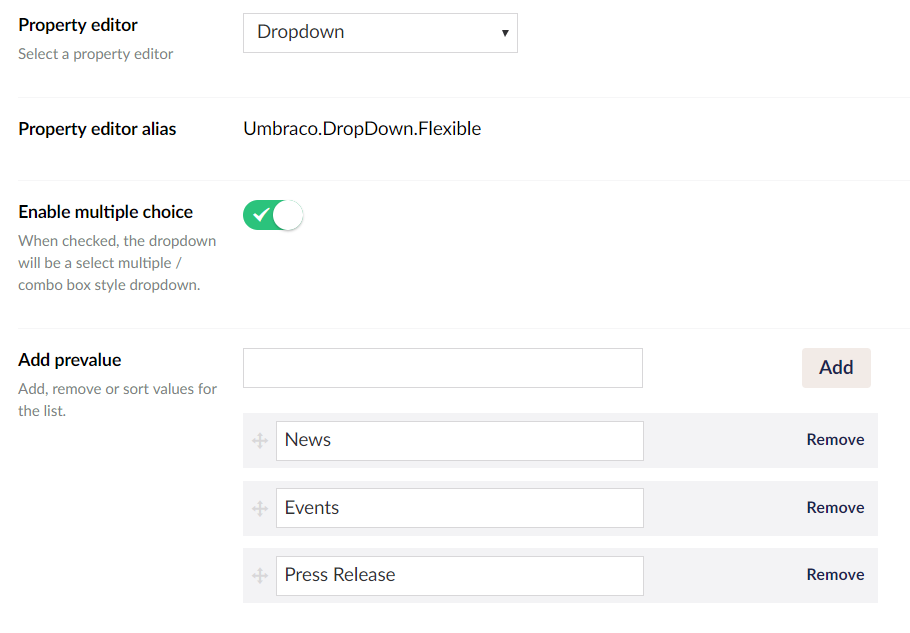

# Dropdown

`Alias: Umbraco.DropDown.Flexible`

`Returns: String` or `IEnumerable<string>`

Displays a list of preset values. Either a single value or multiple values (formatted as a collection of strings) can be returned.

## Settings

### Enable multiple choice

If enabled, editors will be able to select multiple values from the dropdown otherwise only a single value can be selected.

### Prevalues

Prevalues are the options which are shown in the dropdown list. You can add, edit, or remove values here.

## Data Type Definition Example



## Content Example

### Single Value


### Multiple Values


## MVC View Example

### Single item - without Modelsbuilder

```csharp
@if (Model.HasValue("category"))
{
    <p>@(Model.Value<string>("category"))</p>
}
```

### Multiple items - without Modelsbuilder

```csharp
@if (Model.HasValue("categories"))
{
    var categories = Model.Value<IEnumerable<string>>("categories");
    <ul>
        @foreach (var category in categories)
        {
            <li>@category</li>
        }
    </ul>
}
```

### Single item - with Modelsbuilder

```csharp
@if (Model.Category.HasValue())
{
    <p>@Model.Category</p>
}
```

### Multiple items - with Modelsbuilder

```csharp
@if (Model.Categories.Any())
{
    <ul>
        @foreach (var category in Model.Categories)
        {
            <li>@category</li>
        }
    </ul>
}
```