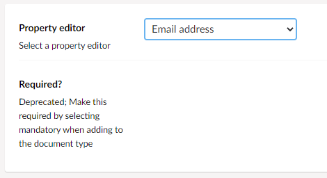
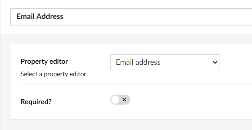

# Email Address

`Alias: Umbraco.EmailAddress`

`Returns: String`

Displays an email address.

## Settings

### Enable required checkbox (8.7.0 and below)

If the property is set to mandatory, Umbraco will display a warning label under the property editor when you publish the page this editor is located on and clean the input. This functionality has been deprecated in `8.8.0` and above. Instead, you select the mandatory checkbox when adding the property editor to a Document Type.

## Data Type Definition Example

### 8.8.0 and higher



### Mandatory checkbox example


### 8.0.0 - 8.7.0



## Content Example


## MVC View Example

### Without Modelsbuilder

```csharp
@if (Model.HasValue("email"))
{
    var emailAddress = Model.Value<string>("email");
    <p>@emailAddess</p>
}
```

### With Modelsbuilder

```csharp
@if (Model.HasValue("email"))
{
    var emailAddress = Model.Email;
    <p>@emailAddess</p>
}
```

## Add value programmatically

See the example below to learn how a value can be added or changed programmatically to an Email-address property. To update a value of a property editor you need the [Content Service](../../../../../Reference/Management/Services/ContentService/index.md).

```csharp
@{
    // Get access to ContentService
    var contentService = Services.ContentService;

    // Create a variable for the GUID of your page
    var guid = new Guid("796a8d5c-b7bb-46d9-bc57-ab834d0d1248");

    // Get the page using the GUID you've just defined
    var content = contentService.GetById(guid);
    // Set the value of the property with alias 'email'
    content.SetValue("email", "stk@umbraco.com");

    // Save the change
    contentService.Save(content);
}
```

:::note
The value sent to an EmailAddress property needs to be a correct email address, e.g. name@domain.com.

It is recommended that you set up validation on this property, in order to verify whether the value added is in the correct format.
:::
