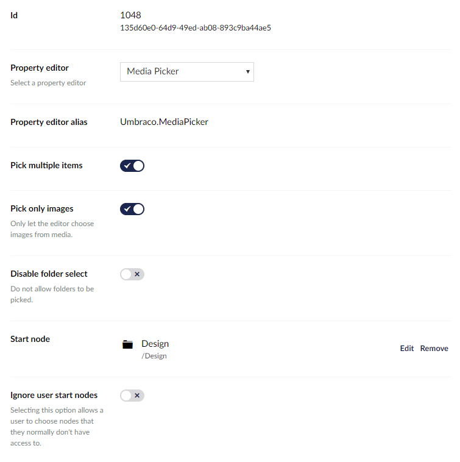

# Media Picker #

`Alias: Umbraco.MediaPicker`

`Returns: IEnumerable<IPublishedContent>` or `IPublishedContent`

This property editors returns a single item if the "Pick multiple items" data type setting is disabled or a collection if it is enabled.

## Data Type Definition Example



### Ignorer user start nodes

Use setting to overrule user permissions, to enable any user of this property to pick any Media Item of the choosen Start node. 

When this setting is enabled, a user who doesn't normally have access to the media selected as "Start Node" (/Design in this case), can access the media when using this particular Media Picker. If no Start node has been defined for this property any content can be viewed and selected of this property.

## Content Example


## MVC View Example

### Multiple enabled without Modelsbuilder

```csharp
@{
    var typedMultiMediaPicker = Model.Value<IEnumerable<IPublishedContent>>("sliders");
    foreach (var item in typedMultiMediaPicker)
    {
        
    }
}
```

### Multiple enabled with Modelsbuilder

```csharp
@{
    var typedMultiMediaPicker = Model.Sliders;
    foreach (var item in typedMultiMediaPicker)
    {
        
    }
}
```

## Multiple disabled without Modelsbuilder

```csharp
@{
    var typedMediaPickerSingle = Model.Value<IPublishedContent>("featuredBanner");
    if (typedMediaPickerSingle != null)
    {
        <p>@typedMediaPickerSingle.Url</p>
        
    }
}
```

## Multiple disabled with Modelsbuilder

```csharp
@{
    var typedMediaPickerSingle = Model.FeaturedBanner;
    if (typedMediaPickerSingle is Image image)
    {
        <p>@image.Url</p>
        
    }
}
```
