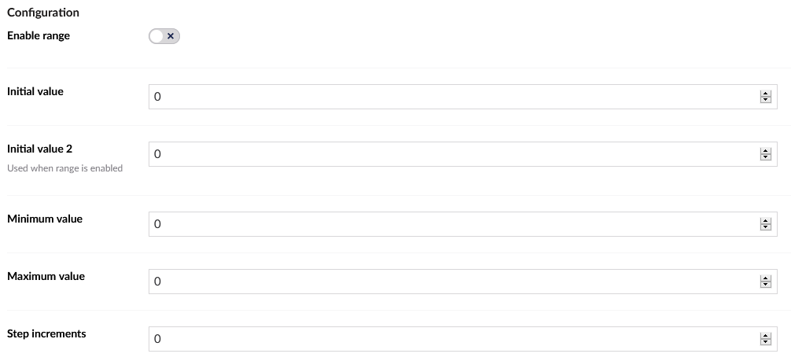

# Slider

`Alias: Umbraco.Slider`

Returns: `decimal` or `Umbraco.Core.Models.Range<decimal>`

Pretty much like the name indicates this Data type enables editors to choose a value with a range using a slider.

There are two flavors of the slider. One with a single value picker. One with a minimum and maximum value.

## Data Type Definition Example



## Content Example


## MVC View Example

### Without Modelsbuilder

```csharp
@if (Model.HasValue("singleValueSlider"))
{
    var value = Model.Value<decimal>("singleValueSlider");
    <p>@value</p>
}

@if (Model.HasValue("multiValueSlider"))
{
    var value = Model.Value<Umbraco.Core.Models.Range<decimal>>("multiValueSlider");
    <p>@(value.Minimum) and @(value.Maximum)</p>
}
```

### With Modelsbuilder

```csharp
// with a range off
@if (Model.SingleRangeSlider.HasValue())
{
    var value = Model.SingleRangeSlider;
    <p>@value</p>
}

// with a range on
@if (Model.MultiValueSlider.HasValue())
{
    var minValue = Model.MultiValueSlider.Minimum;
    var maxValue = Model.MultiValueSlider.Maximum;
    <p>@minValue and @maxValue</p>
}
```
