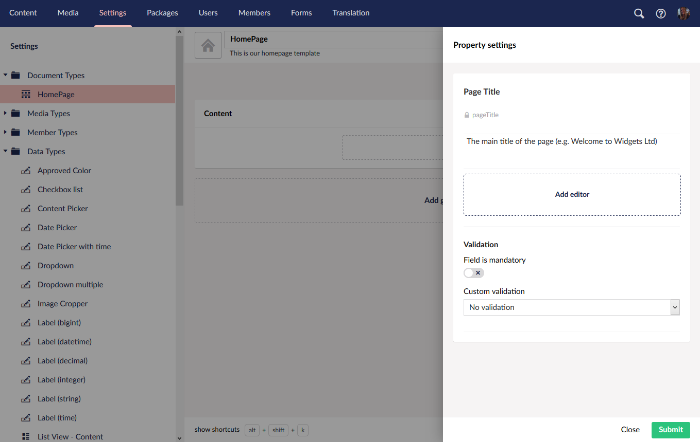
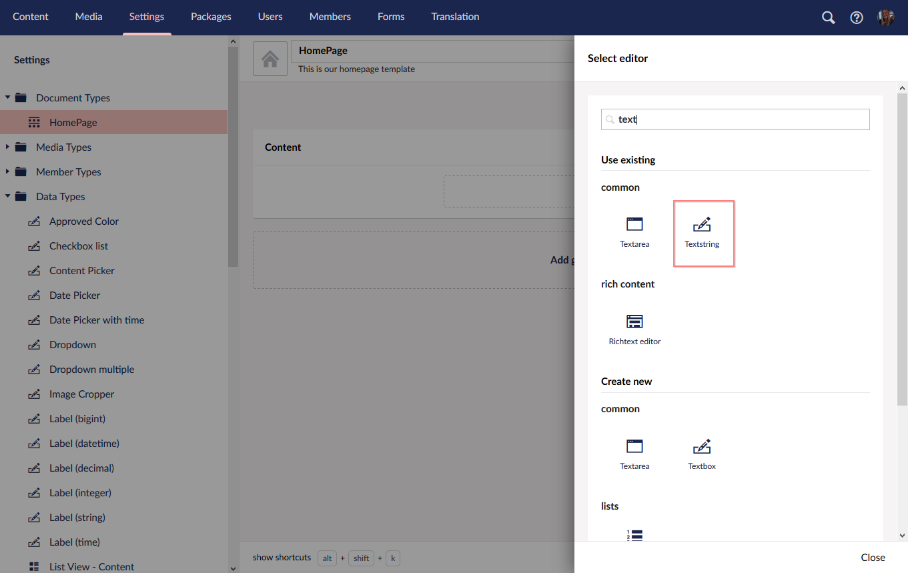
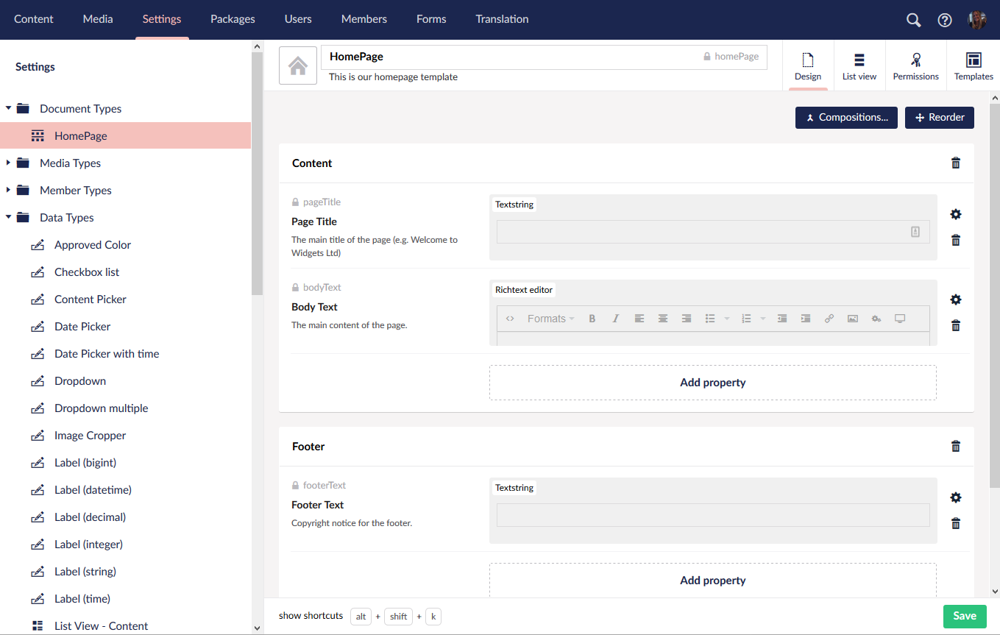

# Document Types

## Data first
### nothing in = nothing out!

Step 1 of any Umbraco site is to create a "**_Document Type_**" – after a few installations you’ll become familiar with this terminology but at the start it might be a little bewildering. A **_Document Type_** is a data container in Umbraco where you can add **_Properties_** (data fields/attributes) where an editor can input data. Umbraco will output this data to the relevant part of a "**_Template_**" (more on these later).

**_Document Types_** are infinitely extendable but usually you’ll add the following common properties:

*    Page title
*    Sub Heading
*    Body Text
*    Meta Title
*    Meta Description
*    ...

Each **_Property_** has a **_Data Type_** - e.g. maybe a text string, a number or rich text body... we’ll come to this later.

## Creating your first Document Type

Right, let’s get busy. Go to the **_Settings Menu_** in Umbraco. This is the third button on the top navigation menu. Then you’ll see a long list of settings – don’t worry about these yet, we’ll introduce them as we need them.

**_Document Types_** is positioned as the first option in the list and is always the starting point for any Umbraco build.  Hover over the **[Document Types]** item and you’ll see three dots **[...]** , click this to see the menu. Then you'll see four options, click the [Document Type] option - we want a template automatically created for us.

:::tip
Using folders can help you organise your **_Document Types_**.
:::

Enter "_HomePage_" as the **[Name]** of our new **_Document Type_** - you'll see that an **_Alias_** is automatically created for us.

Enter in the **[Description]** field "_This is our homepage template_".  This text is used to help the editors choose the correct **_Document Type_** when creating new **_Content Nodes_** back in the **Content Section**.

Click [Save] to store our new **_Document Type_**.

Our new **_Document Type_** is now visible as a new item in the **_Settings Tree_** under **[Document types]**. Now we're going to give this **_Document Type_** an icon to help our editors when they will be working with multiple **_Document Types_** in the **_Content Tree_**. Click the white document icon next to the name field, enter "_home_" into the search field that appears and select the house icon.

Next, click the **[Permissions]** icon and check **[Allow as root]**.  This will allow us to create a homepage at the root of the **_Content Tree_**.

:::note
If none of your **_Document Types_** have the **[Allow as root]** checked, all of them will be allowed to be created at the root level.
:::

Next, we go back to the **_Design_** screen. Create a new group called "_Content_".

Now click on the **Add property** link – this is where we can create the data containers in which the editors can enter the content for the homepage.
Enter the **[Name]** "_Page Title_". When you move to the next field you’ll see Umbraco has automatically generated the **_Alias_** "pageTitle". 
You should also enter a **[Description]**. This helps the editor to provide relevant content, so we'll fill this in "_The main title of the page (e.g. Welcome to Widgets Ltd)_".

Now click the **[Add editor]** link, type "_text_" in the search box and select the existing editor for the "Textstring" **_Data Type_**.

Ignore the rest of the fields for now and click the green **[Submit]** button at the bottom right.

:::tip
Remember to come back and explore the list of **_Data Types_** later - it's a hint to the power of Umbraco.
:::

Repeat this step to add two more properties:

<table border="0">
<col width="130">
<col width="400">
<tr><th>Name</th><th>Body Text</th></tr>
<tr><td>Group:</td><td>Content</td></tr>
<tr><td>Alias:</td><td>bodyText</td></tr>
<tr><td>Description:</td><td>The main content of the page.</td></tr>
<tr><td>Data Type:</td><td>Richtext editor (use the search to find this existing editor)</td></tr>
</table>

<table border="0">
<col width="130">
<col width="400">
<tr><th>Name</th><th>Footer Text</th></tr>
<tr><td>Group:</td><td>Footer (you'll have to add this group first!)</td></tr>
<tr><td>Alias:</td><td>footerText</td></tr>
<tr><td>Description:</td><td>Copyright notice for the footer.</td></tr>
<tr><td>Data Type:</td><td>Textstring</td></tr>
</table>

:::tip
Use the **[Add group]** link to create a new group called Footer for the Footer Text.
:::

You should now have a **_Document Type_** that looks like this:

Remember to click **[Save]**.

We’ve now created our first **_Document Type_** – Umbraco needs three things to create a webpage and this is the first and most important. It takes the data inside an instance of the **_Document Type_** (aka a **_Content Node_**) and merges it with a **_Template_** – we’ll create our template next.

---
## Next - [Creating Your First Template and Content Node](../Creating-Your-First-Template-and-Content-Node)
How to create your first **_template_** and create a **_Content Node_**.
