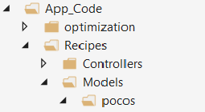
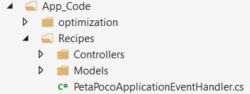

# Tutorial - Creating Tables in Umbraco with PetaPoco

## Overview

This guide will take you through the steps needed to create tables in Umbraco using PetaPoco and the ability to access data in those tables.

## What is Peta Poco?

PetaPoco is a tiny & fast micro-ORM for .NET. It is tiny with no dependencies.

## Requirements needed to use PetaPoco

- Umbraco 7+ with an SQL Database
- Nuget Peta Poco Package - Optional (https://www.nuget.org/packages/PetaPoco/)

## Steps to create your first table
- [Setting up the folders](#setting-up-the-folders)
- [Creatung our first table](#creating-our-first-table)
- [Implementing new table](#implementing-new-table)
- [Accessing the new table](#accessing-the-new-table)

## Related Links
[CollaboratingPlatypus/PetaPoco](https://github.com/CollaboratingPlatypus/PetaPoco)

## Setting up the folders 
First, we need set up structure for our data and tables. Under the `App_Code` folder, create a `Recipes` folder.  Next under `Recipes` create a folder called `Models` and under that folder create a folder called `pocos` or `PetaPocos`. In the `pocos` or `PetaPocos` folder the table will be created.



## Creating our first table
Next, we need to create a table, we are going to call it `Recipe`. Next, we need to create a table, we are going to call it `Recipe`. In the sample code, line 4 and 5 are needed in order to set up the table in the database. `Umbraco.Core.Persistence` and  `Umbraco.Core.Persistence.DatabaseAnnotations` contain the methods Umbraco uses for databases and table. The line after that is the path to the poco file. Here is some sample code, and we will explain it as well: 

```csharp
using System;
using System.Collections.Generic;
using System.Text;
using Umbraco.Core.Persistence;
using Umbraco.Core.Persistence.DatabaseAnnotations;

namespace Recipes.Models.pocos
{

    [TableName("CMSRecipes")]
    [PrimaryKey("RecipeId", autoIncrement = true)]
    [ExplicitColumns]

    public class recipe
    {
    
        [Column("RecipeId")]
        [PrimaryKeyColumn(AutoIncrement = true)]
        public int RecipeId { get; set; }
     
        [Column("RecipeName")]
        [Length(250)]
        public string RecipeName { get; set; }

        [Column("Description")]
        [SpecialDbType(SpecialDbTypes.NTEXT)]
        public string Description { get; set; }

        [Column("Directions")]
        [SpecialDbType(SpecialDbTypes.NTEXT)]
        public string Directions { get; set; }

        [Column("ServingSize")]
        [NullSetting(NullSetting = NullSettings.Null)]
        [Length(100)]
        public string ServingSize { get; set; }

        [Column("DateSubmitted")]
        public DateTime DateSubmitted { get; set; }

        [Column("DateApproved")]
        [NullSetting(NullSetting = NullSettings.Null)]
        public DateTime DateApproved { get; set; }

        [Column("UserId")]
        [NullSetting(NullSetting = NullSettings.Null)]
        public int UserId { get; set; }
       
        [Column("CategoryID")]
        public int CategoryID { get; set; }
        
    }

}
```

## Implementing new table
Next we want to implement the table in the Umbraco website as well as the database. First we will create a `PetaPocoApplicationEventHandler.cs` file under the `Recipes` folder.  



This file will help us create the new table `Recipe` for our site. One thing to note in the sample code, `ApplicationEevntHandler` and `Umbraco.Core.Persistence` are required to create the table. The first line is necessary to access the table code:

```csharp
using Recipes.Models.pocos;
using Umbraco.Core;
using Umbraco.Core.Persistence;

namespace Recipes
{
    public class PetaPocoApplicationEventHandler : ApplicationEventHandler
    {
        protected override void ApplicationStarted(UmbracoApplicationBase umbracoApplication, ApplicationContext applicationContext)
        {
            var ctx = applicationContext.DatabaseContext;
            var db = new DatabaseSchemaHelper(ctx.Database, applicationContext.ProfilingLogger.Logger, ctx.SqlSyntax);

            if (!db.TableExist("CMSRecipes"))
            {
                db.CreateTable<recipe>(false);
            }    

        }
    }
}

```
Once you restart the site, the table will be created. You will be thrown errors for any code issues before the table is created.

If you have access to the database, you can use `Microsoft SQL Server Management Studio` to check for the table.

## Accessing the new table
Now, once we built our methods to access the data, we can use them in either `Template`, `Partial View`, or a `Macro`. When any of those files are being built, you must have the path to poco in your file. Here is an example of accessing the data in a `Partial View Macro`:

```csharp
using System.Collections.Generic;
using System;
using System.Linq;
using Umbraco.Core.Persistence;
using Recipes.Models.pocos;

namespace Recipes.Models
{

    public class Recipes
    {

        // Saves Inserted data
        public recipe Save(recipe items)
        {
            UmbracoDatabase db = Umbraco.Core.ApplicationContext.Current.DatabaseContext.Database;
            db.Save(items);
            return items;

        }
        // Gets Recipe By Id
        public static recipe GetRecipe(int RecipeId)
        {
            UmbracoDatabase db = Umbraco.Core.ApplicationContext.Current.DatabaseContext.Database;
            List<recipe> Recid = db.Fetch<recipe>("SELECT * FROM CMSRecipes WHERE Recipeid = @0", RecipeId);
            db.CompleteTransaction();
            db.CloseSharedConnection();
            if (Recid.Count > 0)
                return Recid[0];
            else
                return null;
        }
        // Get Recipe By Name
        public static recipe GetRecipeID(string RecipeName)
        {
            UmbracoDatabase db = Umbraco.Core.ApplicationContext.Current.DatabaseContext.Database;
            List<recipe> Recid = db.Fetch<recipe>("SELECT RecipeID FROM CMSRecipes WHERE RecipeName = @0", RecipeName);
            db.CompleteTransaction();
            db.CloseSharedConnection();
            if (Recid.Count > 0)
                return Recid[0];
            else
                return null;
        }

    }
}    
```
Now once, we built our methods to access the data, we can use them in either `Template`, `Partial View` or a `Macro`. When any of those files are being built, you must have the path to poco in your file. Here is an example of accessing the data in a `Partial View Macro`:

```csharp
@inherits Umbraco.Web.Macros.PartialViewMacroPage
@using Recipes.Models.pocos
@using Recipes.Models
<div class="page-header clearfix">
    <h2 class="page-title pull-left">
        Recipes <span id="spinner" class="loaded"><i class="fa fa-spinner fa-spin fa-sm"></i></span>
    </h2>
</div>

<div class="toolbar-grid clearfix">

</div>

<table class="table table-bordered table-striped table-hover table-responsive" id="results">
    
            <thead>
                <tr>

                    <th>Name</th>
                    <th></th>
                    <th>Status</th>
                    <th>Date Submitted</th>

                </tr>
            </thead>


            @{
            foreach (var Allrecs in Recipes.GetAdminRecipes())
            {

            <tr>
                <td><a href="/recipe-update-form.aspx?id=@Allrecs.RecipeId">@Allrecs.RecipeName</a></td>
                <td><a href="/recipe-page?id=@Allrecs.RecipeId&@Allrecs.RecipeName">View</a></td>
                <td>
                    @switch (@Allrecs.StatusId)
                    {
                    case 1:
                    <div>Submitted</div>
                    break;
                    case 2:
                    <div>Approved</div>
                    break;
                    case 3:
                    <div>Rejected</div>
                    break;
                    case 4:
                    <div>Deleted</div>
                    break;

                    }
                </td>
                <td>@Allrecs.DateSubmitted</td>
            </tr>

            }

            }

        </table>
```


## Conclusion:
This is a way of implementing external database tables into your Umbraco website.
