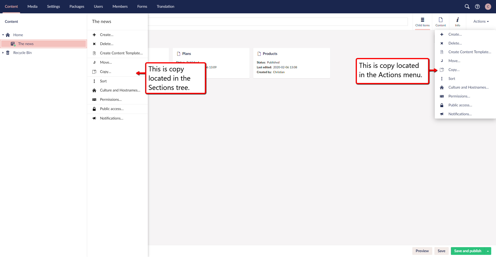
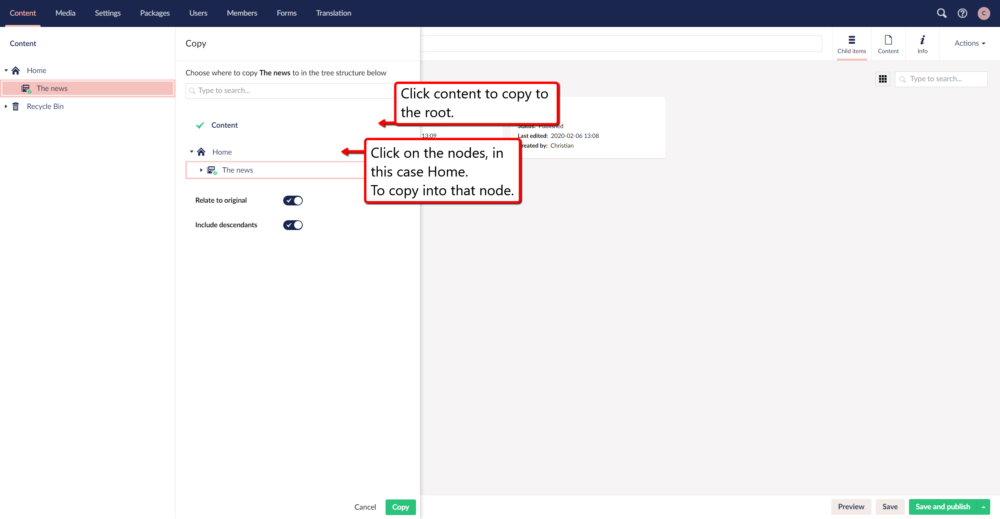

# Copying a Page

If you want to re-use a page or structure you have created previously you can copy the page and its child pages to a different place within the site structure. When you copy a page all of its child pages will also be copied as the default setting. You can choose to not have the child pages copied.
 You can define whether links should be automatically updated, or keep the linkage with the original pages.

1. You can either select the page you want to copy and click the ***Actions*** button in the top right. Alternatively, you can right-click the page title in the content tree which will slide out the context menu.
2. Select ***Copy*** from either the Actions menu or the menu presented by right-clicking the node in the tree.

3. Select the parent page which you want to copy the page to.

4. Select whether to **Relate to original** page.
5. Select whether to **Include descendants** (child pages)
6. Click ***Move***.

:::info
When you select **Relate to original** Umbraco will create a relationship between the original and copies page. This relationship can be used to programmatically link the pages: For example linking between pages in a multilingual setup. It is important to note that this relationship **does not** keep the content between the master original and copied page in sync.:::

