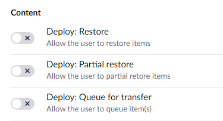

# Users on Umbraco Cloud

On Umbraco Cloud users work almost identical as they do on a normal installation of Umbraco however you have a few more settings available when working on Umbraco Cloud.

In this article, we will show what these settings is and how you can use them.

## User group permissions for transfers and restores

A feature on Umbraco Cloud is the possibility to control who has access to transferring and restoring content and media on your Umbraco Cloud project.

This can be done when creating a new User Group or when editing an existing one.

You have the option to decide whether a specific User Group can do a restore, partial restore or if they can queue content for transfer to the next environment.

It is also possible to get Granular control on a per node basis, so that you can disable restore and transfer for specific content on your site, which can help avoid mistakes and ensure proper workflows are followed.

### Set up Permissions for transfers and restores

There is two ways that you can set up these permissions.
You can either create a new User Group and set the permissions there or you can edit an existing group.

To create a new User group, go to the User section of the backoffice.

In the right corner, you need to click on "Groups".
From here you are able to either create a new or edit an existing User Group.

Click on "Create group" and scroll down and look under "Default permissions" where you can see the three options:

You can then decide whether the users in the new User Group can restore, restore partial or transfer content.

To edit an already existing user group go to the User group you want to edit, e.g Editors or Writers and set the permissions from there.

### Granular Permissions

As mentioned it is also possible to set Granular permissions for a specific content node in your user groups on your cloud project.

You can set the permission when you are creating or editing an existing user group.

In the bottom of the user group, you can add the setting for Granular permission for your content nodes.

When you click add, you can choose which content node on your project that you want to set the Granular settings for.

When you have choosen the node that you want to set the settings for, you can then set the permissions for restore, partial restore and queueing content for transfer.

