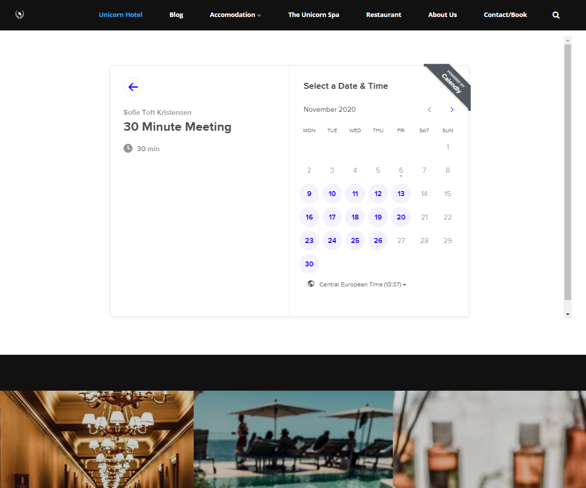

# Extending Uno

There are a couple of ways to extend your Umbraco Uno website with custom code and external services.

In this article, you can learn more about each of these options.

## Custom Code

You have an option to enabled Custom Code on your Umbraco Uno project. Doing this will give you the option to extend Umbraco Uno in any manner you see fit, and you will also be able to extend the project with packages.

Enabling the option to add custom code to your Uno project does also mean that you will no longer receive automatic upgrades specifically for Umbraco Uno. Because of this, enabling custom code is not the best option for all projects.

Learn more about custom code and how to enable it in the [Custom Code](../../Custom-Code) article.

## Embed external services

Another option to extending your Umbraco Uno project is to use the Code widget, which can be added to the Grid widget.

The Code widget lets you add any code snippet or embed code that you want. This means that you embed a large variety of services that extends your website with additional functionality.

Using the Code widget to embed and integrate third-party services with your Umbraco Uno websites gives you the opportunity to use other services while still keeping your users on your website.

There are many third-party services to choose between, here are a few samples:

* Add a chat service to your website by using [Tidio live chat](https://www.tidio.com/knowledge/getting-started/how-to-install-chat-on-your-website/).
* Let visitors on your website book a time with you through [Calendly](https://help.calendly.com/hc/en-us/articles/223147027-Embed-options-overview).
* Show your most recent reviews using [TrustPilot](https://support.trustpilot.com/hc/en-us/articles/203840826-Add-a-TrustBox-widget-to-a-webpage).

[More available services.](https://elfsight.com/widgets/)

### How to use the Code widget

The following steps will take you through the steps of adding a third-party service to your Umbraco Uno website, by using the Grid and the Code widgets.

1. Add a Grid widget to a page or Global Content in the backoffice of your Umbraco Uno project.
  a. Alternatively you can also choose to use an existing Grid on your project.
2. Add a Code widget to the Grid.
3. Set the column width (mandatory).
4. Find and copy the embed code from the external service.
5. Paste the embed code directly into the "Code" field in the Code widget.
6. Confirm the changes and save the page.

In the image below, the Calendly service has been integrated into a Umbraco Uno website following the steps above:

:::note
It is important to note that we do not support the functionality of any third-party services that are integrated into your Umbraco Uno website.
:::

:::links
## Related articles

- [Custom Code](../../Custom-Code)
- [Widgets](../../Widgets)
- [Code widget](../../Widgets/Grid/Code)
- [Grid widget](../../Widget/Grid)
- [Working with Widgets](../Working-with-widgets)

:::
