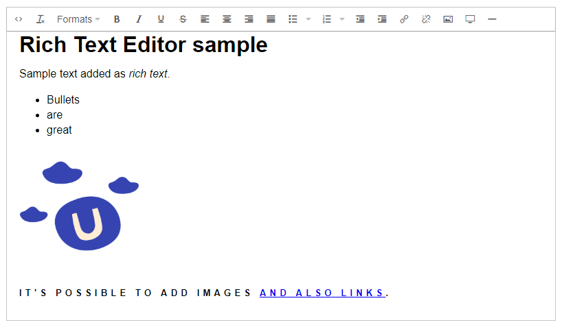

# Rich Text Editors

Many of the options to add generic text to an Umbraco Uno project provides to option to add the text as *rich text* through a so called **Rich Text Editor**.

The Rich Text Editor provides the option to add additional formatting and styling to sections of otherwise plain text. Customizing the text with options such as italics and bold or organize longer sections using unordered or ordered bullet lists are some of the most commonly used features in the Rich Text Editor.

The image above provides an example of how the Rich Text Editor looks in the Umbraco backoffice. One of the main benefits with using the Rich Text Editor is that the formatting and styles added to text using the editor, will also be applied to the text on the frontend. An editor like this is also often refered to as a "What you see is what you get (WYSIWYG)" editor.

This article provides an overview of the various formatting and styling options provided by the Rich Text Editor.

## Formats

Each Rich Text Editor in Umbraco Uno provides a set of pre-defined text formats. These can be accesed by selecting the "Formats" dropdown in the Rich Text Editor toolbar.

The pre-defined formats include 6 sizes for headings, specific styling for quote elements and for big text.

When adding images through the Rich Text Editor, the image will by default be added on a new line. Use the *Image Left* or *Image Right* format options to place image in the same line as the text.

### Adding formatting

Applying a pre-defined format to a piece of text can be achieved in one of two ways:

* Select/highlight a piece of text (or place the cursor on the text) that has already been added and choose the wanted format from the dropdown list, or
* Select the wanted format from the dropdown list and then start adding the text.

### Clear formatting

In some cases it might become necessary to remove the formatting that has been added to a line or section of text. This can be done by using the *Clear formatting* option which is to the left of the "Formats" dropdown in the Rich Text Editor toolbar.

* Select/highlight the text where the formatting needs to be cleared (or place the cursor on the text)
* Click on *Clear formatting* to remove any styles added to the selected text and turn it back to the default format.

## Font styles

Spice up plain text section by using **bold** and *italics* and underline a word to highlight its importance.

these are all options that might seem very familiar as they are usually part of the toolset of any text editors, e.g. Microsoft Word and Google Docs to name a few.

## Alignment and indentations

The Rich Text Editor provides a set of various options for aligning text and images as well as using different types of indentation.

The following four options are available for aligning content: Left, Center, Right and Justify.

Besides the options to create ordered and unordered lists, it is also possible to create single indentations using either of the two options: *Decrease indent* and *Increase indent*.

## Multi-media options

Along with plain text, a few other elements can be added to content throught the Rich Text Editor:

* Convert pieces of text to **links**
* Add **images and media** from the Media library
* **Embed** external resourcdes such as videos
* Mark the ending of a section by **drawing a horizontal line**

## Shortcuts / key-bindings / Easy access

As with many other text editors, it's possible to use general keyboard shortcuts when editing text through the Rich Text Editors.

Here's a few examples of the shortcuts available in Umbraco Uno:

* Ctrl+b to toggle **bold**
* Ctrl+i to toggle *italics*
* Ctrl+u to toggle underline
* Ctrl+k to open the links dialog
* Ctrl+f to searh within the active Rich Text Editor
